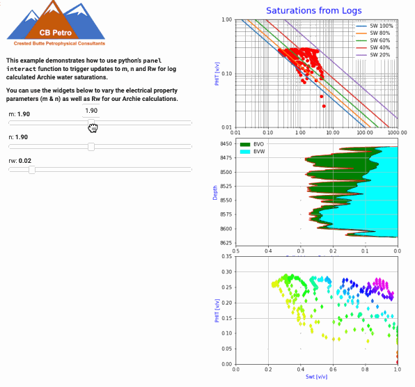

# Calculate-Archie-Water-Saturations-after-Fine-Tuning-Electrical-Properties-to-Pickett-and-Buckles-Pl
Calculate Archie Water Saturations after Fine-Tuning Electrical Properties to Pickett and Buckles Plots using Python’s Panel Library.

While experimenting with interactive python tools for our next GitHub repository, we came upon a python library called panel. Panel appears to provide the type of interaction that we need for our petrophysical analysis. This simple example represents work in progress, but we have placed this python tool this GitHub repository for others to try use and hopefully improve upon what we have so far.

In the animated example below, we are calculating Archie water saturations from a Costa Field well. The panel tool shown below calculates a new water saturation as you vary the electrical properties (m&n) or Rw. The tool provides instantaneous results that can be seen in from the changes in the saturation lines in the Pickett plot as well as the depth plot BVW results.

Panel provides the type of interactivity that allows the user to fine-tune their analysis using the Pickett and Buclkes plots. The Pickett plot is fundamental to our calculation of water saturations from conventional logs, and this tool will allow you to build a better understanding of your data and allow you to develop a better feel for the sensitivity of each parameter used in the Archie water saturation calculation.

In this example well, the interval at the bottom of the depth plot appears to be wet. However, is this interval at 100% Sw or does it contain some residual oil? We do not have residual fluid saturations from core to allow us to determine if there is any residual oil saturations in the core from this interval, so we have made the assumption that the intervals is 100% water saturated for now. In this example we adjust the m and Rw to give us 100% water saturations from logs for this lower interval.

>
